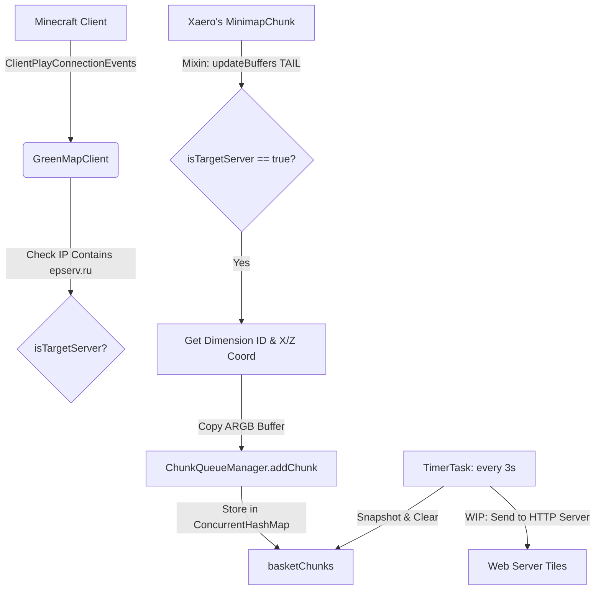

# AGENTS.md — Developer and Agent Guide for GreenMap

GreenMap is a **client-only Fabric mod** for Minecraft (target version 26.1.2) written in Kotlin, with Mixins written in Java. It hooks into Xaero's Minimap to intercept rendered chunk pixel data (ARGB buffers) and store them in a queue to prepare them for upload to a web server (for an online interactive map).

---

## 🛠️ Toolchain and Environment

- **Build System**: Gradle (Kotlin DSL) + **Fabric Loom**.
  - Windows wrapper: `gradlew.bat`
  - Unix wrapper: `./gradlew`
- **Java Toolchain**: **Java 25** (`targetJavaVersion = 25`, Mixin `compatibilityLevel: JAVA_25`). A JDK 25 is required.
- **Mappings / Obfuscation**:
  - Starting with Minecraft 26.1.1+, Mojang has removed obfuscation from the client/server distributions. 
  - There is **no mapping layer** (like Yarn or Mojmap) applied. We reference classes and methods by their native, official names (e.g., `Minecraft.getInstance().level.dimension().identifier()`).
- **Common Tasks**:
  - Build: `./gradlew build`
  - Compile Client Kotlin: `./gradlew compileClientKotlin`
  - Compile Client Java: `./gradlew compileClientJava`
  - Dev Client Launch: `./gradlew runClient` (launches Minecraft dev instance)

---

## 📂 Source Code Layout (Split Source Sets)

Loom's `splitEnvironmentSourceSets()` is active. Mixing up source sets will break compilation.
- `src/main/` — Contains common files (mostly metadata like `fabric.mod.json`).
- `src/client/` — Contains all client-side code:
  - **Kotlin**: `src/client/kotlin/org/greamples/greenmap/client/`
    - `GreenMapClient.kt`: Entrypoint. Listens to server join/disconnect events. Sets safety flags.
    - `ChunkQueueManager.kt`: Implements the thread-safe queue and periodic worker task.
  - **Java**: `src/client/java/org/greamples/greenmap/mixin/client/`
    - `MinimapChunkMixin.java`: Mixin that hooks Xaero's Minimap render buffers.
  - **Resources**: `src/client/resources/greenmap.client.mixins.json`
    - Registered mixins must be listed here.

---

## 🏗️ Architecture and Data Flow

### 1. Connection and Filter Gating (`GreenMapClient.kt`)
- Filters connection by IP to ensure we only capture map data on target servers.
- Currently gates on the domain `epserv.ru` (checks if the server IP `.contains("epserv.ru")` to support subdomains like `ekb.mc.epserv.ru`, `3.ekb.mc.epserv.ru`, etc.).
- Keeps a `@Volatile var isTargetServer` flag updated.

### 2. Intercepting Render Buffers (`MinimapChunkMixin.java`)
- Injects at the `TAIL` of Xaero's `updateBuffers(int levelsToLoad, int[][] intArrayBuffer, CallbackInfo ci)`.
- Verifies that `isTargetServer` is `true` before doing anything.
- Reads `this.X` and `this.Z` (chunk coordinates).
- Obtains the current dimension identifier as a String from the client world:
  `Minecraft.getInstance().level.dimension().identifier().toString()` (e.g., `"minecraft:overworld"`).
- Safely copies the 256 ARGB pixel integers from `this.buffer[0]` (using a duplicated buffer to prevent concurrent read/write issues).
- Hands the chunk data over to `ChunkQueueManager.INSTANCE.addChunk(dimension, chunkX, chunkZ, pixelData)`.

### 3. Thread-Safe Queue (`ChunkQueueManager.kt`)
- Stores incoming chunks in `basketChunks: ConcurrentHashMap<String, IntArray>`.
- The key is structured as `"$dimension:$chunkX:$chunkZ"`. This prevents coordinates in different dimensions (e.g., Nether vs Overworld) from overwriting each other in the queue.
- If a chunk updates multiple times within the batch interval, it simply overwrites the old entry, saving network traffic.
- Runs a background `Timer` task every 3 seconds. It copies the queue map, clears the original, and prints the batch size.
- **WIP**: Ready for JSON serialization and HTTP POST dispatching.

---

## ✍️ Coding Conventions and Rules

- **Comments**: Maintain the established style. Write inline code comments in **Russian** (Русский) unless requested otherwise by the user.
- **Dependencies**: Manage all versions in `gradle/libs.versions.toml`. Do not hardcode versions in build scripts.
- **Verification**: Ensure compilation with `./gradlew compileClientJava compileClientKotlin` passes. Verify that `runClient` launches.

---

## 📚 Useful References and Documentation (Minecraft 26.1+ / Unobfuscated)

Since Minecraft 26.1+ has no obfuscation layer, mod development is simplified. However, developers still need official references for Fabric and Mixin environments.

- **Fabric Wiki**: [https://fabricmc.net/wiki/](https://fabricmc.net/wiki/)
  - Direct guide on Fabric Modding, client entrypoints, and environment setups.
- **Fabric Loom Reference**: [https://fabricmc.net/wiki/developer-guide:loom](https://fabricmc.net/wiki/developer-guide:loom)
  - Detailed documentation on Loom configuration options, dependency declarations, and split source environments.
- **SpongePowered Mixin Documentation**: [https://github.com/SpongePowered/Mixin/wiki](https://github.com/SpongePowered/Mixin/wiki)
  - Guide on writing Mixins, using `@Shadow`, `@Inject`, targeting methods, and resolving compile-time annotation issues.
- **Official Minecraft Developer Tools**: [https://github.com/Mojang/](https://github.com/Mojang/)
  - Check Mojang's official repositories for any shared libraries, schema specifications, or telemetry structures.
- **Decompiling & Class Navigation**:
  - In an unobfuscated environment, use the Gradle Loom task `./gradlew genSources` to generate fully readable, decompiled Minecraft client/server sources directly inside the IDE.
  - You can navigate directly to net.minecraft classes (`Minecraft`, `Level`, `ResourceKey`, etc.) in the IDE without checking external databases.
